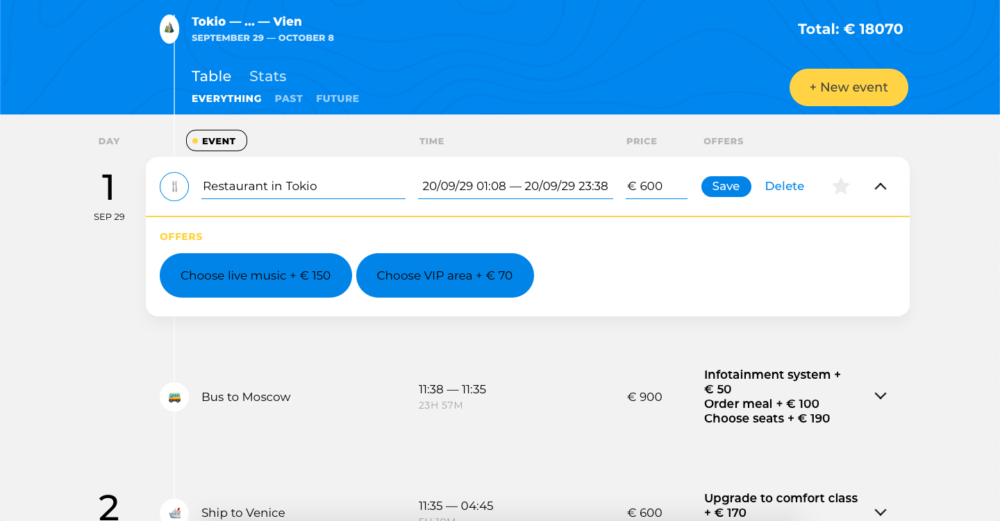
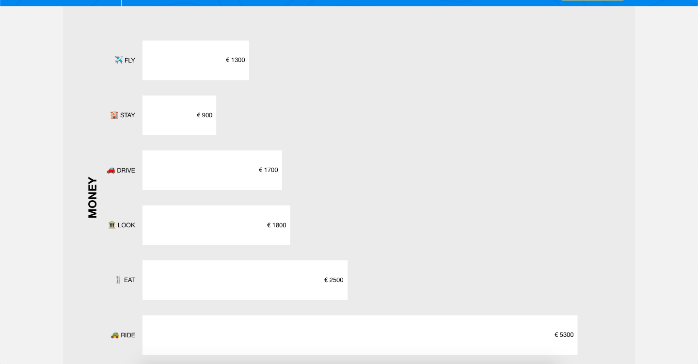
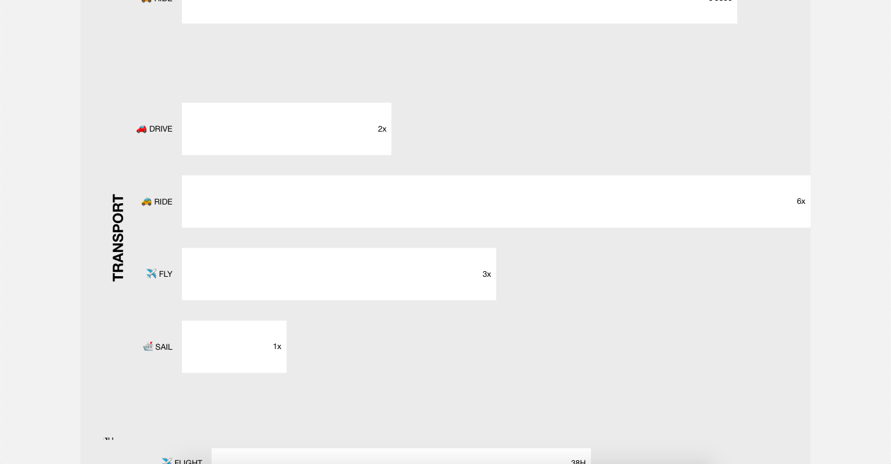
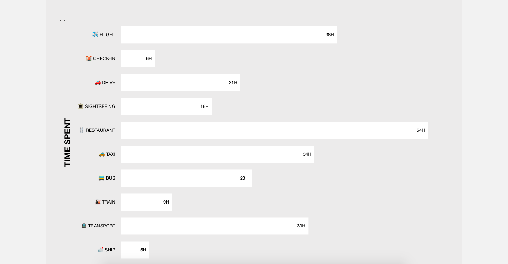

# Personal Project Big Trip

[![Build status][travis-image]][travis-url]

## Big Trip – it's an application, for planning your trip

* **Editing/creating your points**

  It provides creating trip points, adding:
  * type of point (bus , check-in , drive , flight , restaurant , ship , sightseeing , taxi , train , transport )
  * destination (one of the list of cities)
  * date and time
  * price
  * additional offers (depending on the selected point type)
* **Sorting your points by time/price**
* **Filtering your points as past/future points**
* **Statisctics for all of your points**
  * **By cost**
    
  * **By transport types**
    
  * **By time spent**
    

[travis-image]: https://travis-ci.com/htmlacademy-ecmascript/583693-big-trip-12.svg?branch=master
[travis-url]: https://travis-ci.com/htmlacademy-ecmascript/583693-big-trip-12

## About development tools

* Created using [MVP](https://ru.wikipedia.org/wiki/Model-View-Presenter) design pattern
* Building by [webpack](https://webpack.js.org)
* Connected to external [server](https://12.ecmascript.pages.academy/big-trip/
)
